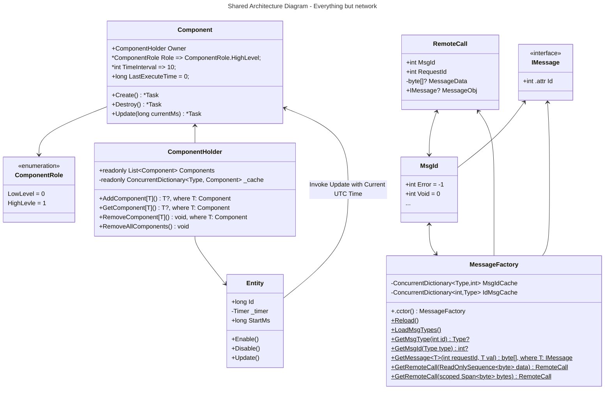
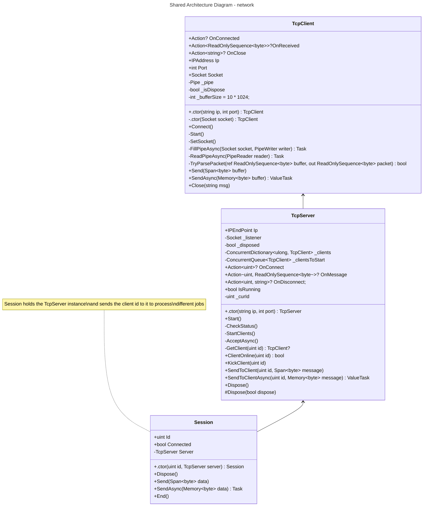
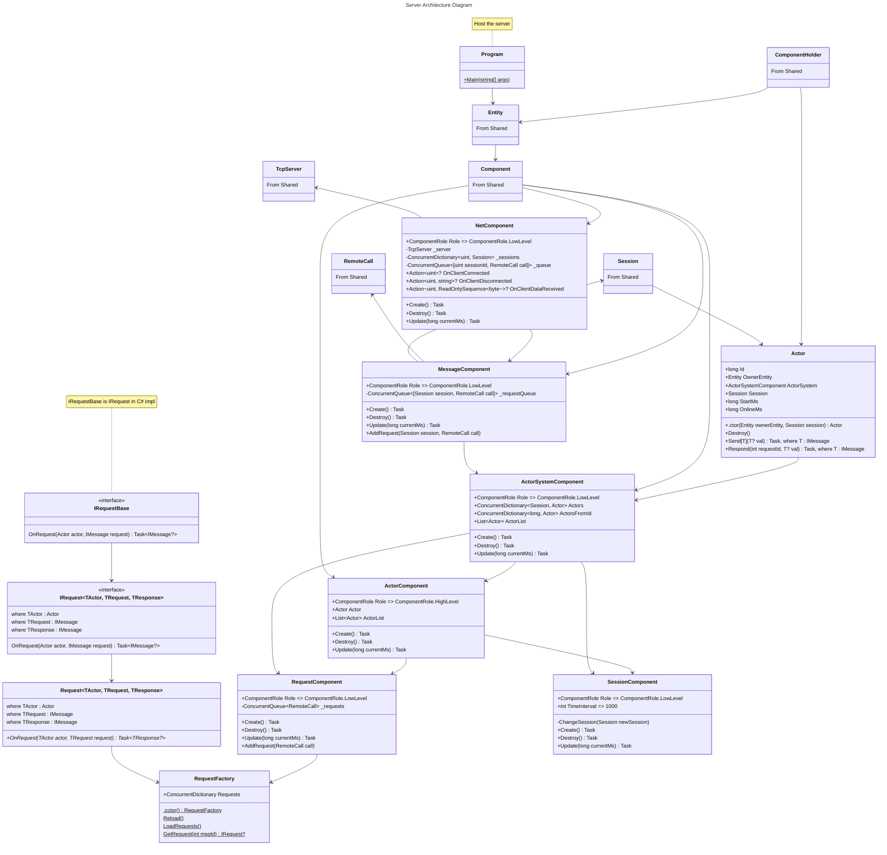

# DaServer

A developing dotnet(C#) RPC server.

## Architecture

```mermaid
---
title: Shared Architecture Diagram - Everything but network
---
classDiagram
    class ComponentRole{
        <<enumeration>>
        LowLevel = 0
        HighLevle = 1
    }
    class Component{
    +ComponentHolder Owner
    *ComponentRole Role => ComponentRole.HighLevel;
    *int TimeInterval => 10;
    +long LastExecuteTime = 0;
    +Create() *Task
    +Destroy() *Task
    +Update(long currentMs) *Task
    }
    Component --> ComponentRole
    class ComponentHolder{
        +readonly List~Component~ Components
        -readonly ConcurrentDictionary~Type, Component~ _cache
        +AddComponent[T]() T?, where T: Component
        +GetComponent[T]() T?, where T: Component
        +RemoveComponent[T]() void, where T: Component
        +RemoveAllComponents() void
    }
    Component <-- ComponentHolder
    class Entity{
        +long Id
        -Timer _timer
        +long StartMs
        +Enable()
        +Disable()
        +Update()
    }
    ComponentHolder --> Entity
    Entity  --> Component : Invoke Update with Current UTC Time
    class RemoteCall{
        +int MsgId
        +int RequestId
        -byte[]? MessageData
        +IMessage? MessageObj
    }
    class IMessage{
        <<interface>>
        +int .attr Id
    }
    class MsgId{
        +int Error = -1
        +int Void = 0
        ...
    }
    RemoteCall <--> MsgId
    IMessage <-- MsgId
    IMessage <-- MessageFactory
    RemoteCall <-- MessageFactory
    class MessageFactory{
        -ConcurrentDictionary~Type,int~ MsgIdCache
        -ConcurrentDictionary~int,Type~ IdMsgCache
        +.cctor() MessageFactory
        +Reload()$
        +LoadMsgTypes()$
        +GetMsgType(int id)$ Type?
        +GetMsgId(Type type)$ int?
        +GetMessage~T~(int requestId, T val)$ byte[], where T: IMessage
        +GetRemoteCall(ReadOnlySequence~byte~ data)$ RemoteCall
        +GetRemoteCall(scoped Span~byte~ bytes)$ RemoteCall
    }
    MsgId <--> MessageFactory
```

```mermaid
---
title: Shared Architecture Diagram - network
---
classDiagram
    class TcpClient{
        +Action? OnConnected
        +Action~ReadOnlySequence~byte~~?OnReceived
        +Action~string~? OnClose
        +IPAddress Ip
        +int Port 
        +Socket Socket
        -Pipe _pipe
        -bool _isDispose
        -int _bufferSize = 10 * 1024;
        +.ctor(string ip, int port) TcpClient
        -.ctor(Socket socket) TcpClient
        +Connect()
        -Start()
        -SetSocket()
        -FillPipeAsync(Socket socket, PipeWriter writer) Task
        -ReadPipeAsync(PipeReader reader) Task
        -TryParsePacket(ref ReadOnlySequence~byte~ buffer, out ReadOnlySequence~byte~ packet) bool
        +Send(Span~byte~ buffer)
        +SendAsync(Memory~byte~ buffer) ValueTask
        +Close(string msg)
    }
    class TcpServer{
        +IPEndPoint Ip
        -Socket _listener
        -bool _disposed
        -ConcurrentDictionary~ulong, TcpClient~ _clients
        -ConcurrentQueue~TcpClient~ _clientsToStart
        +Action~uint~? OnConnect
        +Action~uint, ReadOnlySequence~byte~~? OnMessage
        +Action~uint, string~? OnDisconnect;
        +bool IsRunning
        -uint _curId
        +.ctor(string ip, int port) TcpServer
        +Start()
        -CheckStatus()
        -StartClients()
        -AcceptAsync()
        -GetClient(uint id) TcpClient?
        +ClientOnline(uint id) bool
        +KickClient(uint id)
        +SendToClient(uint id, Span~byte~ message)
        +SendToClientAsync(uint id, Memory~byte~ message) ValueTask
        +Dispose()
        #Dispose(bool dispose)
    }
    TcpClient <-- TcpServer
    TcpServer <-- Session
    class Session{
        +uint Id
        +bool Connected
        -TcpServer Server
        +.ctor(uint id, TcpServer server) Session
        +Dispose()
        +Send(Span~byte~ data)
        +SendAsync(Memory~byte~ data) Task
        +End()
    }
    note for Session "Session holds the TcpServer instance\nand sends the client id to it to process\ndifferent jobs"
```

```mermaid
---
title: Server Architecture Diagram
---
classDiagram
    class IRequestBase{
        <<interface>>
        OnRequest(Actor actor, IMessage request) Task~IMessage?~
    }
    note for IRequestBase "IRequestBase is IRequest in C# impl"
    class IRequest~TActor, TRequest, TResponse~{
        <<interface>>
        where TActor : Actor
        where TRequest : IMessage
        where TResponse : IMessage
        OnRequest(Actor actor, IMessage request) Task~IMessage?~
    }
    IRequestBase --> IRequest~TActor, TRequest, TResponse~
    IRequest~TActor, TRequest, TResponse~ --> Request~TActor, TRequest, TResponse~
    class Request~TActor, TRequest, TResponse~{
        where TActor : Actor
        where TRequest : IMessage
        where TResponse : IMessage
        +OnRequest(TActor actor, TRequest request)* Task~TResponse?~
    }
    class RequestFactory{
        +ConcurrentDictionary<int, IRequest> Requests
        .cctor()$ RequestFactory
        Reload()$
        LoadRequests()$
        GetRequest(int msgId)$ IRequest?
    }
    Request --> RequestFactory
    class ComponentHolder{
        From Shared
    }
    class Entity{
        From Shared
    }
    class Component{
        From Shared
    }
    class TcpServer{
        From Shared
    }
    class Session{
        From Shared
    }
    class RemoteCall{
        From Shared
    }
    class NetComponent{
        +ComponentRole Role => ComponentRole.LowLevel
        -TcpServer _server
        -ConcurrentDictionary~uint, Session~ _sessions
        -ConcurrentQueue~[uint sessionId, RemoteCall call]~ _queue
        +Action~uint~? OnClientConnected
        +Action~uint, string~? OnClientDisconnected
        +Action~uint, ReadOnlySequence~byte~~? OnClientDataReceived
        +Create() Task
        +Destroy() Task
        +Update(long currentMs) Task
    }
    class MessageComponent{
        +ComponentRole Role => ComponentRole.LowLevel
        -ConcurrentQueue~[Session session, RemoteCall call]~ _requestQueue
        +Create() Task
        +Destroy() Task
        +Update(long currentMs) Task
        +AddRequest(Session session, RemoteCall call)
    }
    class ActorSystemComponent{
        +ComponentRole Role => ComponentRole.LowLevel
        +ConcurrentDictionary~Session, Actor~ Actors
        +ConcurrentDictionary~long, Actor~ ActorsFromId
        +List~Actor~ ActorList
        +Create() Task
        +Destroy() Task
        +Update(long currentMs) Task
    }
    class RequestComponent{
        +ComponentRole Role => ComponentRole.LowLevel
        -ConcurrentQueue~RemoteCall~ _requests
        +Create() Task
        +Destroy() Task
        +Update(long currentMs) Task
        +AddRequest(RemoteCall call)
    }
    class SessionComponent{
        +ComponentRole Role => ComponentRole.LowLevel
        +int TimeInterval => 1000
        -ChangeSession(Session newSession)
        +Create() Task
        +Destroy() Task
        +Update(long currentMs) Task
    }
    class Actor{
        +long Id
        +Entity OwnerEntity
        +ActorSystemComponent ActorSystem
        +Session Session
        +long StartMs
        +long OnlineMs
        +.ctor(Entity ownerEntity, Session session) Actor
        +Destroy()
        +Send[T](T? val) Task, where T : IMessage
        +Respond<T>(int requestId, T? val) Task, where T : IMessage
    }
    class ActorComponent{
        +ComponentRole Role => ComponentRole.HighLevel
        +Actor Actor
        +List~Actor~ ActorList
        +Create() Task
        +Destroy() Task
        +Update(long currentMs) Task
    }
    class Program{
    +Main(string[] args)$
    }
    note for Program "Host the server"
    Program --> Entity
    TcpServer <-- NetComponent
    Session <-- MessageComponent
    RemoteCall <-- MessageComponent
    Session --> Actor
    ComponentHolder --> Actor
    NetComponent --> MessageComponent
    MessageComponent --> ActorSystemComponent
    ComponentHolder --> Entity
    Entity --> Component
    Component --> NetComponent
    Component --> MessageComponent
    Component --> ActorSystemComponent
    ActorSystemComponent --> RequestComponent
    ActorSystemComponent --> SessionComponent
    Component --> ActorComponent
    ActorSystemComponent --> ActorComponent
    ActorComponent --> RequestComponent
    ActorComponent --> SessionComponent
    Actor --> ActorSystemComponent
    RequestComponent --> RequestFactory
```

> Todo: Client Architecture