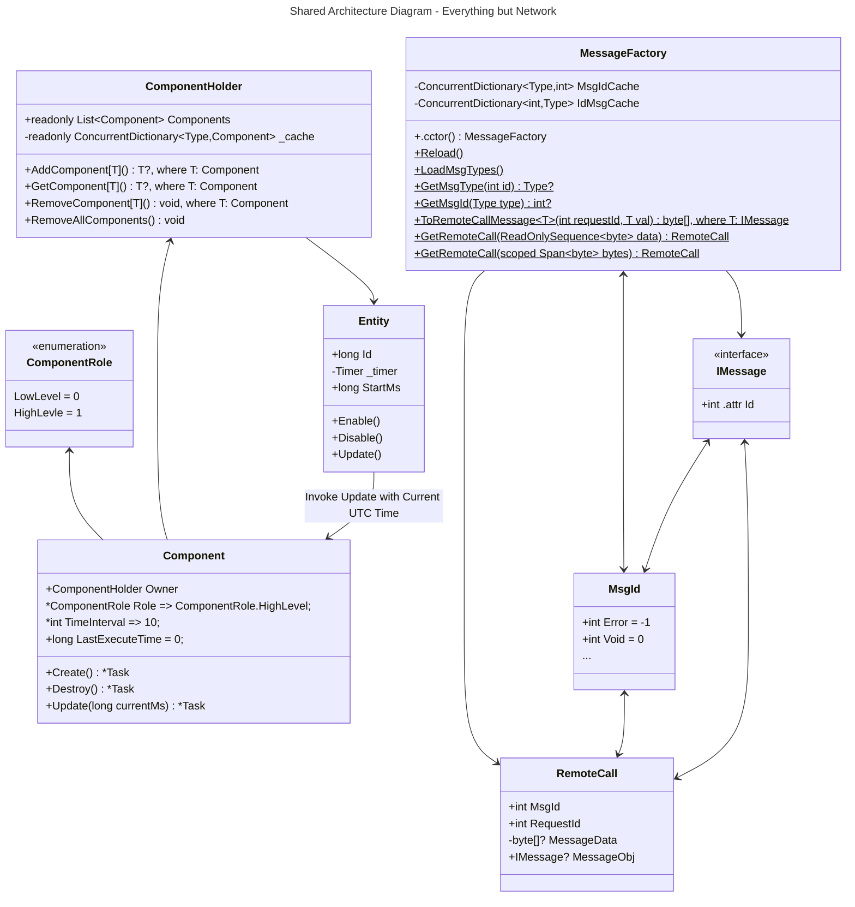
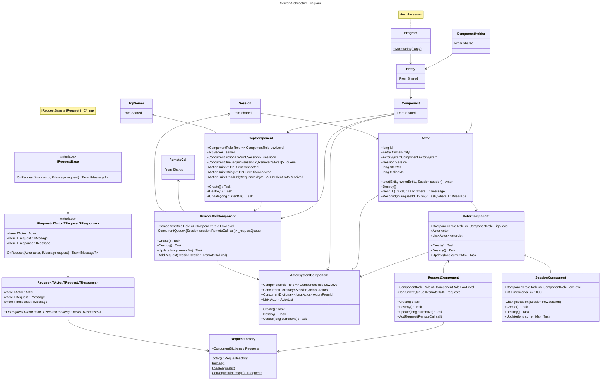

# DaServer

A developing dotnet(C#) RPC server.

## Architecture
### Shared Architecture Diagram - Everything but Network

### Shared Architecture Diagram - Network

### Server Architecture Diagram

> Todo: Client Architecture